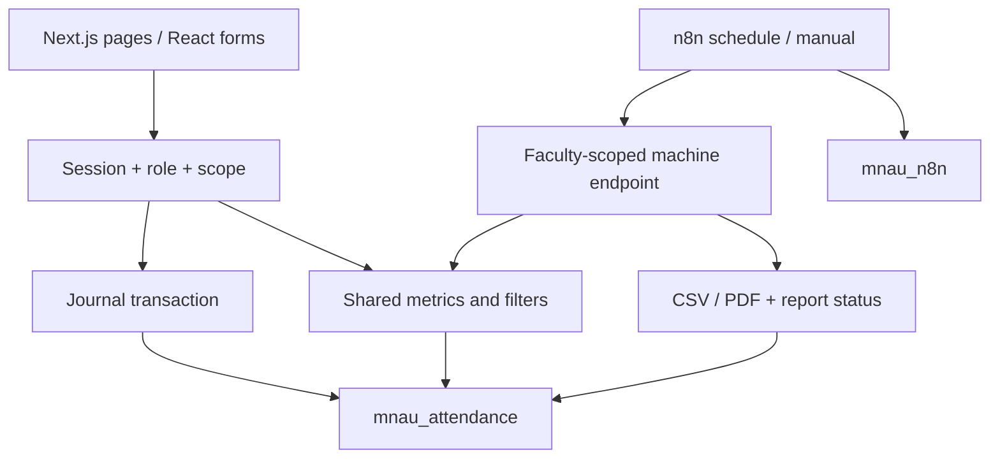

# Architecture

Браузер не соединяется с PostgreSQL или n8n. Server Components и API используют общий серверный слой `src/lib`, Prisma 7 и PostgreSQL adapter. Proxy только предварительно перенаправляет при отсутствии cookie; каждая защищённая страница/API проверяет сессию и актуальные роли/назначения.

Login поддерживает JSON после hydration и обычный POST HTML-формы (`application/x-www-form-urlencoded`/multipart) без JavaScript. HTML-путь возвращает 303 на приложение или на `/login?error=...`; email и пароль не помещаются в URL. Проверка Origin, bcrypt, одинаковая ошибка неверных credentials и DB rate limit общие. Cookie содержит случайный opaque token; в Session хранится SHA-256 и реальный срок истечения. HttpOnly/SameSite=Lax, Secure при HTTPS; production требует HTTPS. Сроки сессии и rate limit не зависят от demo clock.

Faculty → Specialty → Group(course) → Student. User отделён от Student/Teacher; UserRole связывает несколько Role. CuratorAssignment и DeanAssignment задают реальные области. ADMIN является системной ролью. Teacher связан с аккаунтом через Teacher.userId; староста через Student.userId и роль STAROSTA. Admin UI симметрично добавляет/снимает назначения, не удаляя профили или учебную историю. Транзакция проверяет ADMIN повторно, защищает занятые профили и фиксирует снимки назначений в AuditLog.

Для совмещённых ролей `rosterScope` и `lessonGroupScope` связывают ограничения занятия и группы в одной ветке разрешения. Например, роль куратора одной группы и преподавателя другой пары не открывает чужой сегмент общего занятия. Та же область используется журналом, историей и аналитикой; пустая область означает пустую выборку. Сохранение журнала и admin assignment change блокируют затрагиваемую User-строку и повторно проверяют полномочия внутри транзакции.

LessonGroup связывает одно занятие с несколькими группами; LessonStudent фиксирует ожидаемый roster. Attendance имеет составную уникальность student+lesson и FK в roster, собственный status и confirmed. User/Profile relations не удаляются при снятии назначения.

Lesson.version обновляется условным UPDATE внутри транзакции. Статусы, подтверждение, AuditLog и JournalSubmission входят в ту же транзакцию. Конкурентная устаревшая версия получает 409. Idempotency requestId привязан к пользователю, занятию и хешу payload; повтор возвращает актуальные серверные строки без повторного изменения или аудита. UI имеет блокировку повторного submit, показывает подтверждение и сохраняет локальную черновую форму при ошибке. Существующие значения не заменяются PRESENT при загрузке.

Каждая строка имеет серверные editable/canConfirm. Староста меняет только неподтверждённые строки своей разрешённой группы, преподаватель подтверждает собственные занятия, куратор/деканат/admin действуют в назначенной области. Для совмещённых ролей AUTO определяет подтверждение отдельно по строке. После завершения дня Europe/Kyiv нужны право исправления и причина. Новое подтверждение одной группы не закрывает другую группу той же пары.

AttendanceStatus содержит PRESENT/N/HV; отсутствие Attendance означает «Не відмічено». Lesson.cancelled хранится отдельно. Aggregate JournalState вычисляется по полному ожидаемому roster всех связанных групп: EMPTY при отсутствии отметок; CONFIRMED только если каждый ожидаемый студент имеет подтверждённую отметку; иначе DRAFT. Карточка может показывать состояние только видимого сегмента. `journalStateForRoster` вычисляет состояние и при чтении; seed, generator и save используют ту же формулу. Миграция `202609060002_complete_roster_journal_state` ремонтирует прежние агрегаты с повышением версии и аудитом, без изменения Attendance. Prisma schema и initial migration сохранены.

Единая метрика `PRESENT / (PRESENT + N) × 100` применяется после суммирования raw counts. HV исключён, нулевой знаменатель даёт null, пороги проверяются до округления. В аналитику входят подтверждённые отметки завершённых неотменённых пар; draft/unmarked и полнота показаны отдельно. Учёт времени использует Europe/Kyiv. Фиксированное 21:00 включается только при APP_ENV=demo + DEMO_MODE=true + валидной DEMO_DATE; пустая дата оставляет реальные часы. UI показывает фактический режим; production/demo-конфликт отклоняется.

Навигация сохраняет period/course/specialty/group/student/threshold в URL на пути до конкретной пары и обратно. `SortHeader` и `sorting.ts` добавляют sort/order без потери фильтров, используют украинский Intl.Collator и числовое сравнение; null всегда в конце, равные значения стабильны. `CustomSelect` улучшает реальный form control после hydration, оставляя GET/no-JS поведение; список в portal наследует общие light/dark variables. ARIA combobox/listbox, клавиатура, outside click и scroll реализованы в компоненте без новой UI-библиотеки.

Reports доступны ADMIN и DEAN_OFFICE в назначенном факультете. Поддержаны DAILY/WEEKLY/MONTHLY и области faculty/specialty/group/student, при необходимости threshold 50/70. `reportPreview` проверяет принадлежность всех фильтров и строит сводку той же аналитикой; выбор одного студента пересчитывает raw counts для него. Preview не создаёт Report. После подтверждения генерируются настоящие CSV/PDF; сохранённая страница показывает область, показатели и строки перед скачиванием.

Report хранит бинарные PDF/CSV, период, фильтры, уникальный key, summary с fingerprint и PENDING/READY/FAILED. Key включает вид/период/область, fingerprint экспортируемые значения и действующие назначения кураторов. Неизменённый повтор использует тот же результат; изменённые данные обновляют существующую запись. Условное занятие PENDING защищает параллельную генерацию; через пять минут незавершённую попытку можно повторить. Ошибка файла сохраняет FAILED. Скачивание требует готового результата и повторной проверки сессии/факультета.

Машинный endpoint `/api/machine/reports` имеет отдельный Bearer token и одну факультетскую область `REPORT_FACULTY_SLUG`. Шесть неактивных exports n8n оркестрируют daily, weekly curators, alerts 50/70, monthly и ручной PDF/CSV report. Weekly создаёт отчёт на каждую группу действующих кураторов; несколько кураторов одной группы не создают дубликаты. Alerts сохраняются с устойчивым alertKey и `delivery: STORED_ONLY`, внешней отправки нет. HTTP nodes выполняют до трёх попыток; `requireReady` делает PENDING ответом 503 с Retry-After для повторной проверки. Final node требует READY, неуспех остаётся в execution history. Пароли и токены отсутствуют в exports, credential хранится в n8n. Остановка n8n не влияет на сохранение журнала или ручные отчёты сайта.

Initial SQL migration содержит внешние ключи, индексы, уникальности и CHECK для курса 1–4, пары 1–8, положительной страницы источника, версии и start/end. Enum-статусы и составной FK исключают постороннего студента в отметке. Исходные PDF/JSON, SourceRecord и provenance сохраняются. Demo seed использует стабильные IDs и не перезаписывает пароли, назначения и отметки; отдельный demo attendance generator заполняет отсутствующие синтетические строки с аудитом и увеличением версии.

Compose сохраняет три основных сервиса web/postgres/n8n, две базы с разными пользователями и persistent volumes; migrate/seed запускаются явно как tools services. `test:integration` и `verify:server` создают отдельную named PGlite БД в памяти, задают тестовую конфигурацию, применяют все миграции и выполняют все integration-файлы последовательно с production standalone Next. Эти тесты не используют рабочее подключение. Чистый npm ci отдельно подтверждён. Docker build/restart/native PostgreSQL isolation не проверены из-за отсутствия Docker; browser QA заблокирован ERR_BLOCKED_BY_CLIENT. Точные результаты приведены в VERIFICATION.md.
